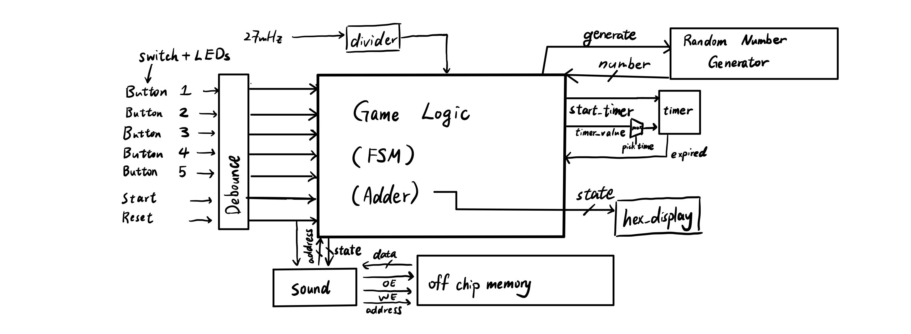

## INTERACTIVE FPGA-BASED ’WHACK-A-MOLE’
GAME WITH ILLUMINATED BUTTON INPUTS AND
INTEGRATED AUDIO
# 1 PROJECT OVERVIEW
This project involves using an FPGA to create a whack-a-mole game by integrating audio and but-
tons with built-in LEDs. Once the game begins, the buttons will randomly light up, and an audio cue
will play to indicate the appearance of moles, challenging the user to press the buttons within their
selected time limit. The FPGA will keep track of scores, which will be displayed on a hex display,
and the game will conclude with an ”end” audio cue.
# 2 HIGH-LEVEL HARDWARE BLOCK DIAGRAM:

# 3 PROJECT MILESTONES
Nov 6 Buy components, Do research on audio files Nov 10
Nov 13 Finish the FSM, Finish Datapath implementation Nov 17
Nov 20 Import Audio Files into off-chip
memory, Connecting FPGA with Lighting
Buttons
Nov 27 Handle clock crossing Debug the code Nov 30
Dec 4 Prepare for project demo and fi-
nalize integration of the project
Prepare for project demo and fi-
nalize integration of the project
Dec 2
